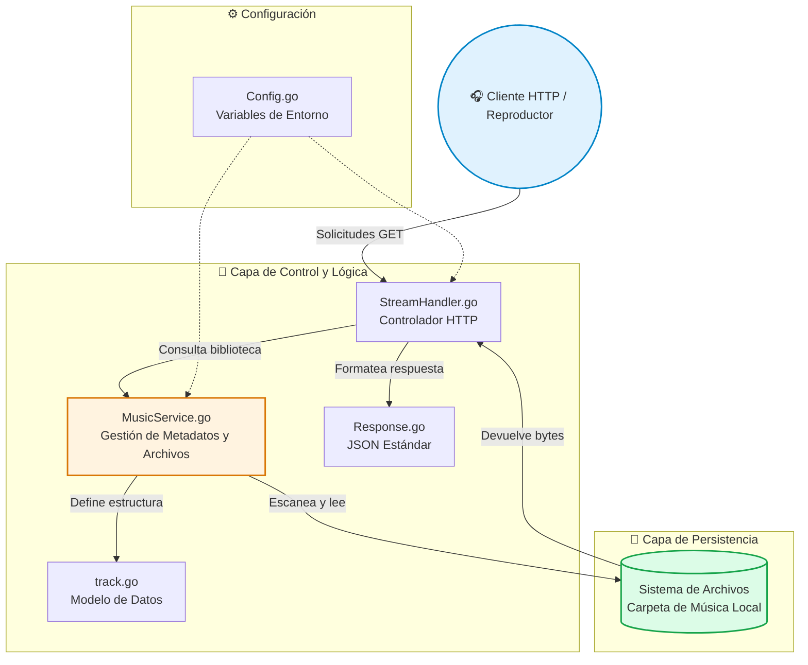
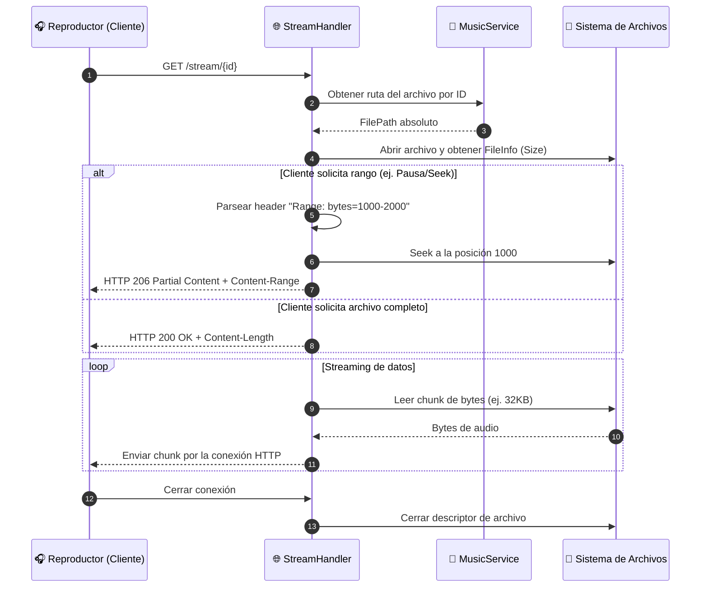

# 🎵 PlayGo Stream - Servidor Local de Música

> **Servidor de streaming de audio ligero y privado** construido en Go. Sirve tu biblioteca de música local (MP3, FLAC, OGG, WAV) a través de una API REST, soportando metadatos, streaming por chunks y control de acceso.

A diferencia de un bot que busca en internet, **PlayGo Stream** está diseñado para ser el backend de tu propia colección de música. Funciona como un "mini Spotify" personal que corre en tu máquina, Raspberry Pi o servidor, sin depender de la nube ni enviar tus datos a terceros.

---

## 🚀 Características Principales

- 🎧 **Streaming Real con Range Requests**: Soporta cabeceras HTTP `Range`, permitiendo a los reproductores clientes pausar, reanudar y avanzar (seek) en la canción sin descargar el archivo completo.
- 🏷️ **Extracción Automática de Metadatos**: Lee etiquetas ID3 y metadatos (Título, Artista, Álbum, Año, Duración) directamente de los archivos usando `github.com/dhowden/tag`.
- 🛡️ **Control de Acceso por IP**: Configuración de lista blanca (whitelist) de IPs permitidas para proteger tu biblioteca en redes locales.
- ⚡ **Arquitectura por Capas (MVC Simplificado)**: Separación clara entre configuración, lógica de negocio (servicio), controladores HTTP y modelos de datos.
- 🛑 **Apagado Elegante (Graceful Shutdown)**: Manejo correcto de señales `SIGINT` y `SIGTERM` para cerrar conexiones y liberar recursos de forma segura.
- 📝 **Logging Estructurado**: Sistema de registro de eventos con rotación y niveles de severidad para monitoreo.

---

## 🏗️ Arquitectura del Sistema

El proyecto sigue un patrón de diseño por capas, garantizando que la lógica de negocio esté desacoplada de la capa de transporte HTTP.



---

## 📂 Estructura del Proyecto

```text
play_go_stream/
├── main.go                    # 🎯 Punto de entrada: inicialización, carga de biblioteca y servidor HTTP
├── controller/
│   ├── Config.go              # 🔧 Carga de variables de entorno (.env) y configuración de logging
│   ├── Log.go                 # 📝 Sistema de logging con rotación y niveles de severidad
│   ├── MusicService.go        # 🎵 Escaneo de directorios, lectura de metadatos (ID3) y gestión en memoria
│   ├── StreamHandler.go       # 🌐 Controlador HTTP: maneja rutas, CORS y Range Requests (HTTP 206)
│   ├── Response.go            # 📦 Utilidades para respuestas JSON estandarizadas
│   └── track.go               # 🎼 Definición de la estructura de datos `Track` (ID, Título, Duración, Hash, etc.)
├── go.mod                     # Dependencias del módulo (Go 1.26.5)
└── go.sum                     # Checksum de dependencias
```

---

## 🔄 Flujo de Streaming (Range Requests)

Este diagrama muestra cómo el servidor maneja eficientemente las solicitudes de reproducción, permitiendo a los clientes solicitar solo fragmentos específicos del archivo de audio.



---

## 📋 Requisitos Previos

- **Go 1.21+** (El proyecto está configurado para 1.26.5)
- Una carpeta con archivos de audio (`.mp3`, `.flac`, `.ogg`, `.wav`)

---

## 🛠️ Instalación y Configuración

### 1. Clonar y preparar el entorno
```bash
git clone https://github.com/MartinCiro/play_go_stream.git
cd play_go_stream
```

### 2. Configurar variables de entorno
Crea un archivo `.env` en la raíz del proyecto basado en la configuración esperada:
```env
# Puerto en el que escuchará el servidor
PORT=8080

# Ruta absoluta a tu biblioteca de música
MUSIC_PATH=/ruta/a/tu/carpeta/de/musica

# IPs permitidas para acceder al servidor (separadas por coma, o "*" para todas)
ALLOWED_IPS=127.0.0.1,192.168.1.*
```

### 3. Instalar dependencias y ejecutar
```bash
# Descargar dependencias (dhowden/tag, godotenv, etc.)
go mod tidy

# Ejecutar en modo desarrollo
go run main.go
```

### 4. Compilar para producción
```bash
go build -o playgo-stream main.go
./playgo-stream
```

---

## 📚 Endpoints de la API

| Método | Ruta | Descripción |
| :--- | :--- | :--- |
| `GET` | `/api/status` | Verifica que el servidor esté corriendo y muestra el conteo de canciones. |
| `GET` | `/api/songs` | Devuelve una lista JSON con los metadatos de todas las canciones indexadas. |
| `GET` | `/api/song/{id}` | Devuelve los metadatos detallados de una canción específica. |
| `GET` | `/stream/{id}` | **Streaming de audio**. Soporta cabeceras `Range` para reproducción eficiente (HTTP 200 / 206). |

---

## 🔒 Seguridad y Privacidad

- **100% Local**: No se envía ninguna información a servidores externos. Todo el procesamiento de metadatos y streaming ocurre en tu máquina.
- **Sin Base de Datos Externa**: La biblioteca se carga en memoria al iniciar, lo que garantiza velocidad y cero dependencias de servicios como SQLite o PostgreSQL para la operación básica.
- **Filtrado de IP**: El middleware de seguridad rechaza automáticamente solicitudes de IPs no autorizadas, protegiendo tu red local.

---

## 🤝 Contribuciones

Las contribuciones son bienvenidas. Si deseas mejorar PlayGo Stream:
1. Haz un Fork del repositorio.
2. Crea una rama para tu funcionalidad (`git checkout -b feature/AmazingFeature`).
3. Realiza tus cambios y haz commit (`git commit -m 'Add some AmazingFeature'`).
4. Haz Push a la rama y abre un Pull Request.

---

## 👤 Autor

**Martin Ciro**  
[](https://github.com/MartinCiro)

---
*Desarrollado con Go, priorizando la eficiencia, la privacidad y el control total sobre tu biblioteca de música.*